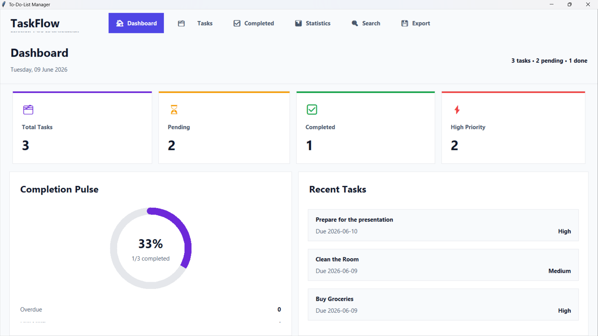
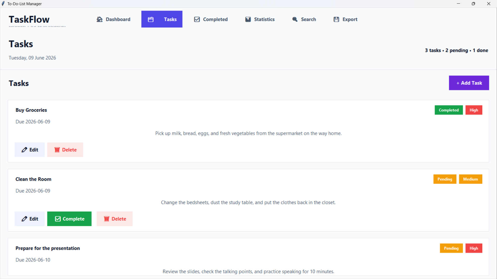
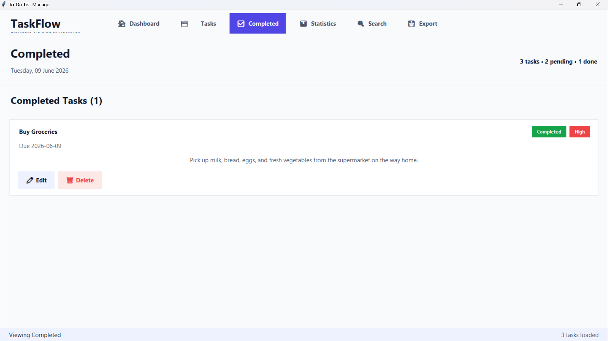
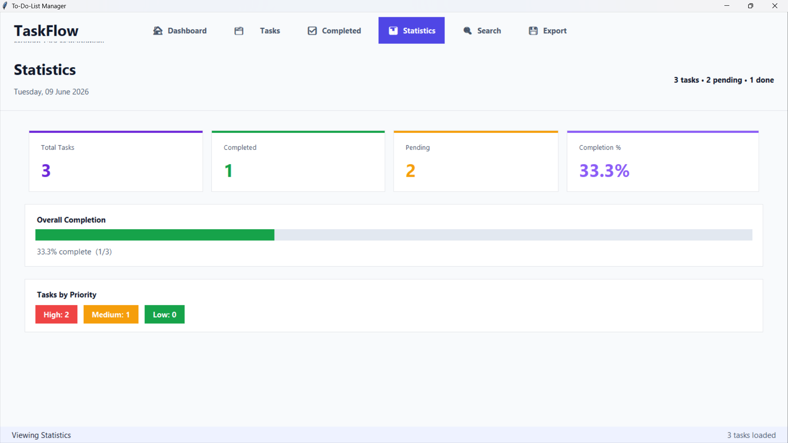
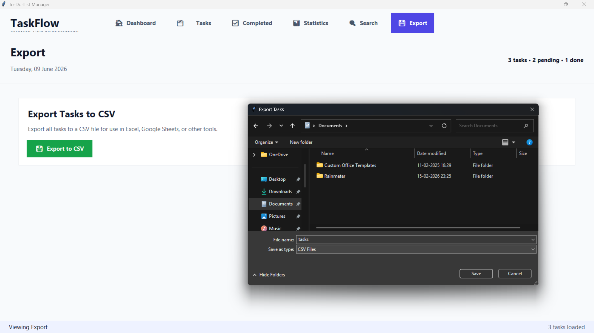

# To-Do List Manager – Personal Productivity Dashboard

A modern desktop-based task management application developed using **Python** and **Tkinter**. The application helps users organize daily activities, track progress, manage priorities, and improve productivity through a clean dashboard interface.

---

## Intern Details

| Field | Details |
|---------|---------|
| Project Name | To-Do List Manager |
| Intern Name | Santosh Kumar Behera |
| Intern ID | CITS2854 |
| Domain | Python Programming |
| Duration | 6 Weeks |
| Organization | CODTECH IT Solutions Pvt. Ltd. |

---

## Project Overview

The To-Do List Manager is designed to provide a simple and efficient way to manage daily tasks. Users can create tasks, update their status, track pending work, and analyze productivity through a modern desktop interface.

The project demonstrates:

- Python GUI Development using Tkinter
- JSON Data Storage
- CRUD Operations
- User Input Validation
- Task Tracking & Management
- Dashboard-Based Design
- Software Documentation
- Git & GitHub Workflow

---

## Features

### Dashboard
- Total Tasks Overview
- Pending Tasks Count
- Completed Tasks Count
- High Priority Tasks Count
- Recent Tasks Table

### Task Management
- Add New Tasks
- Edit Existing Tasks
- Delete Tasks
- Mark Tasks as Completed
- Input Validation

### Search & Filtering
- Search Tasks by Title
- Filter by Priority
- Pending Tasks View
- Completed Tasks View

### Statistics
- Task Completion Percentage
- Priority-wise Breakdown
- Productivity Overview

### Data Management
- JSON Storage
- Automatic File Creation
- Export Tasks to CSV

### User Interface
- Modern Sidebar Navigation
- Professional Dashboard Layout
- Responsive Tkinter Widgets
- Clean and User-Friendly Design

---

## Technologies Used

| Category | Technology |
|-----------|------------|
| Language | Python 3 |
| GUI Framework | Tkinter |
| Data Storage | JSON |
| Export Format | CSV |
| Libraries | tkinter, json, csv, os, datetime |
| IDE | Visual Studio Code |
| Version Control | Git & GitHub |

---

## Project Structure

```text
TO-DO-LIST-MANAGER/
│
├── .gitignore
├── main.py
├── README.md
├── requirements.txt
│
├── assets/
│   └── icons/
│
├── data/
│   └── tasks.json
│
├── documentation/
│   ├── PROJECT_DOC.md
│   └── USER_MANUAL.md
│
└── screenshots/
    ├── dashboard.png
    ├── tasks.png
    ├── completed.png
    ├── statistics.png
    └── export.png
```

---

## Installation

### Clone Repository

```bash
git clone https://github.com/santoshbehera01/To-Do-List-Manager
cd To-Do-List-Manager
```

### Run Application

```bash
python main.py
```

---

## Screenshots

### Dashboard



### Tasks Management



### Completed Tasks



### Statistics



### Export Tasks



---

## Documentation

Detailed project documentation is available in:

```text
documentation/
├── PROJECT_DOC.md
└── USER_MANUAL.md
```

These documents include:

- Project Architecture
- Working Procedure
- Feature Explanation
- User Guide
- Troubleshooting

---

## Data Storage

All task records are stored in:

```text
data/tasks.json
```

The file is automatically created when the application runs for the first time.

---

## Future Enhancements

- Dark Mode Support
- Reminder Notifications
- Calendar Integration
- Task Categories
- Due Date Alerts
- Cloud Synchronization
- PDF & Excel Export
- User Authentication

---

## Learning Outcomes

This project demonstrates practical implementation of:

- Python Programming
- GUI Development with Tkinter
- JSON File Handling
- CRUD Operations
- Data Persistence
- Input Validation
- Software Documentation
- Git & GitHub Workflow

---

## Author

**Santosh Kumar Behera**
Intern ID: **CITS2854**
Python Programming Intern
CODTECH IT Solutions Pvt. Ltd.

---

## License

This project was developed for educational and internship purposes under the CODTECH IT Solutions Pvt. Ltd. Python Programming Internship Program.